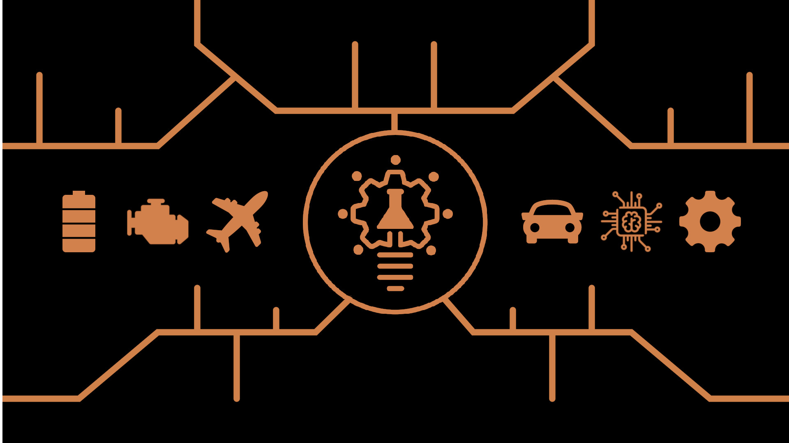

# Preliminary design and sizing mechatronic systems: syllabus

## Authors
- Marc Budinger (marc.budinger@insa-toulouse.fr)
- Scott Delbecq (scott.delbecq@isae-supaero.fr)
- Félix Pollet  (felix.pollet@isae-supaero.fr)
- Aurélien Reysset  (aurelien.reysset@insa-toulouse.fr)

## Course Description

### Objectives
Mechatronic systems are highly complex systems that often have to meet specific and severe requirements depending of the application.
Several architectures in terms of topology and technology often meet the functional requirements and technological constraints.
The ultimate objective is to determine the best of candidate architectures in terms of environmental performance and cost.
For this purpose, this course aims at providing methods and models for the preliminary design and sizing systems composed of multiple technologies.

### Content
- Concept of operations, requirements and architectures
- Technologies, design drivers and sizing scenarios
- Modelling approaches for sizing: simulation and evaluation models
- Modelling approaches for sizing: estimation models
- Sizing procedures
- Design optimization

The course is exemplified through a main study case which is the concept of a load-lifting UAV (Unmanned Aerial Vehicle) with a multirotor architecture.

### Organization
The classes alternate with a short lecture with examples and a lab session where the students apply the concepts on a case study.
Several laboratories have been developed but one is addressed by the students during the course.

### Laboratories
- Package delivery UAV [Link](https://sizinglab.github.io/sizing_course/laboratories/Lab-multirotor/summary.html)
- VEGA Launcher TVC EMA [Link](https://sizinglab.github.io/sizing_course/laboratories/Lab-vega/summary.html)
- Sustainable mobility [Link](https://sizinglab.github.io/sizing_course/laboratories/Lab-mobility/summary.html)

## Tools:
- Course website (https://sizinglab.github.io/sizing_course/)
- Course Github repository (https://github.com/SizingLab/sizing_course)
- Python (Jupyter Notebooks)